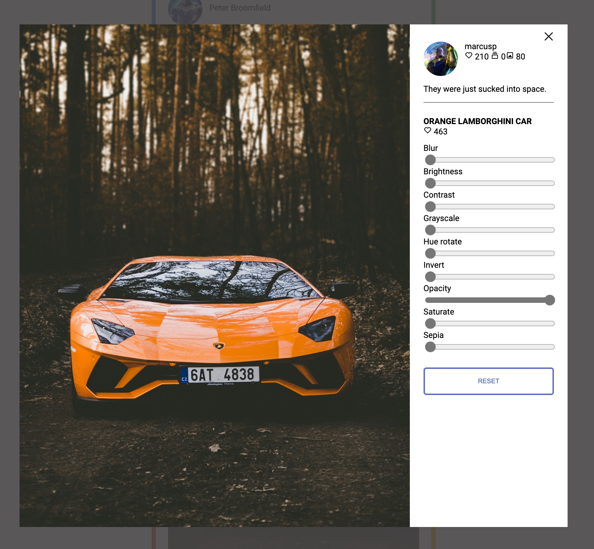
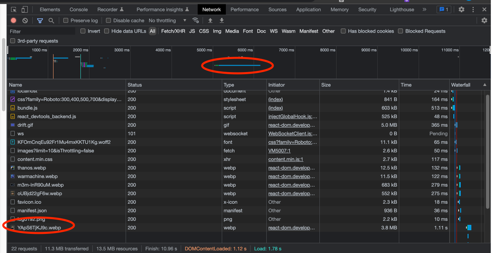
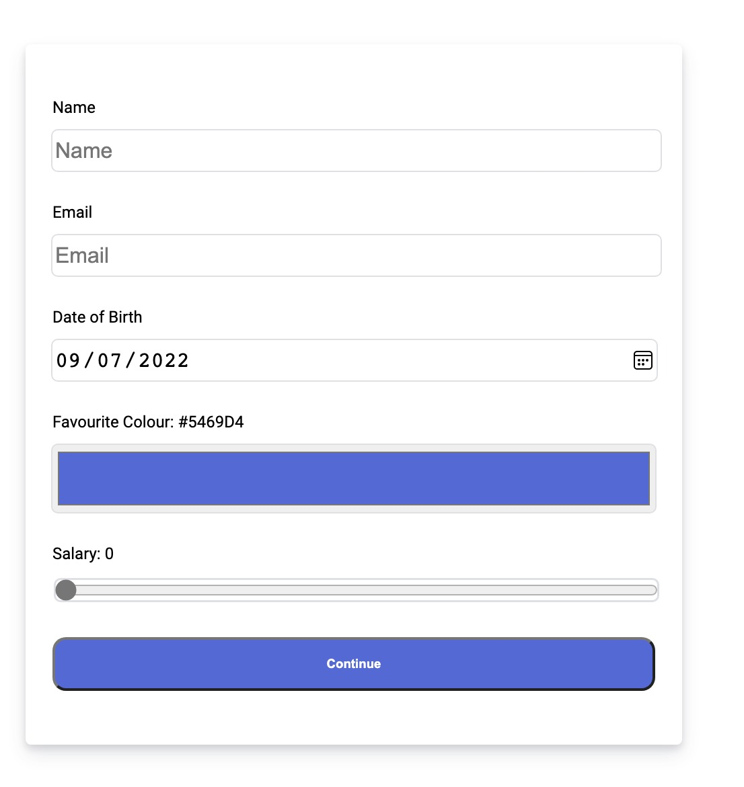

# Motorway UI Test

## Tasks

### 1. UI development

I created the responsive UI for rendering the images returned by the API. Both Desktop and Mobile version also has single column of cards with grid layout in CSS. Each card is constructed by user profile picture, username and the car image. All the UI components are styled by CSS purely and only webp images are used on the home page to have faster  speed for initial page loading.

If user hovers on the card that will have the animation to enlarge the card. If user clicks on the card, it will pop up the overlay for reviewing the full size image with jpg format and has the user info (likes, location, total photos etc) and the image meta data (likes, description etc) on the panel at right hand side. User can also apply the effects such as blur, brightness, contrast to the image with the range inputs when reviewing the image. Click on the area that out of the image and panel for dismiss the overlay.

### 2. Performance

#### Optimizations of loading images
1. **Load webp instead of jpg for the landing page.** Webp image have smaller size typically. For example: m3m-lnR90uM.jpg 808kb vs 683 kb encoded size. User can review the full size jpg images on the overlay

**With webp**

**With jpg**

2. **Lazy loading the images** - allow the images to wait with download until user scrolls down to them, it can shorten page initialization. It can be verified by checking the network tab in Chrome console to fetch the new image when scroll to certain position.

3. **Placeholder gif for every image** - every image have the placeholder gif when waiting for appearing on the UI and we get the placeholder gif from public folder at the same host to give the user a sense of fast loading and will be displayed very soon. If error is happened when fetching the image, we will fall back to another error gif.

**placeholder gif for loading image**

4. As I noticed there is the timeout setting on the server endpoint and I guess it is simulating the slow network environment. This force me to think about how or what we can optimize under the slow network. For real world scenario and if the target audiences are global people, we should setup CDN on cloud service provider to accelerate the image delivery across different regions instead of fetching from original bucket. We can also setup monitoring dashboard to keep track of the response time, latency and the availability of the servers. I passed 1 more queryString **isThrottling** to endpoint GET /images and the value is 'false' to disable the throttling.

#### Speed tests for loading images

I used Chrome Version 103.0.5060.114 to run the performance tests at the Chrome console and each round of test is emptied cache and hard reloaded. They are loaded from the same size of the browser window and same computer for making the comparison as fair as possible. The loading time is contributed by network transfer and image processing. The measurement is focused on the initial load of the car image list.

|                | Old Implementation    | New Implementation      |
|----------------------------------------------|--------|----------|
| The longest duration to load the image - 1st | 2680ms | 969.53ms |
| The longest duration to load the image - 2nd | 2610ms | 776.71ms |
| The longest duration to load the image - 3rd | 2900ms | 878.59ms |

### 3. Forms

I installed package react-router-dom for routing between [home page](http://localhost:3000) and the [form page http://localhost:3000/form](http://localhost:3000/form). We can navigate with navigation bar at the top of the pages. On the form page, user has to pass the client side validations on each input before the form submission. If the input is not valid, error message will be shown under the input field in red color. Otherwise, will open browser alert to display submitted values.

#### Assumptions for the validations
1. Name - cannot empty or empty string and the name cannot be longer than 100 letters
2. Email - cannot empty or any kind of falsy value and must has correct email format
3. Data of birth - cannot empty, must be in right date format and not in the future date
4. Favourite of color - no validation as using standard color input and allocated default value `#5469D4`
5. Salary - no validation as using standard range input and allocated default value `0`

## My Notes

I would like saying thank you to give me the opportunity for taking this test and a lot of fun to implement it. And it helps me to review the fundamental knowledge of HTML/CSS/JS and also learn a lot during the process. I tried my best and hope you like the result.

If you have any questions or comments, please do not hesitate to contact me. Cheers.